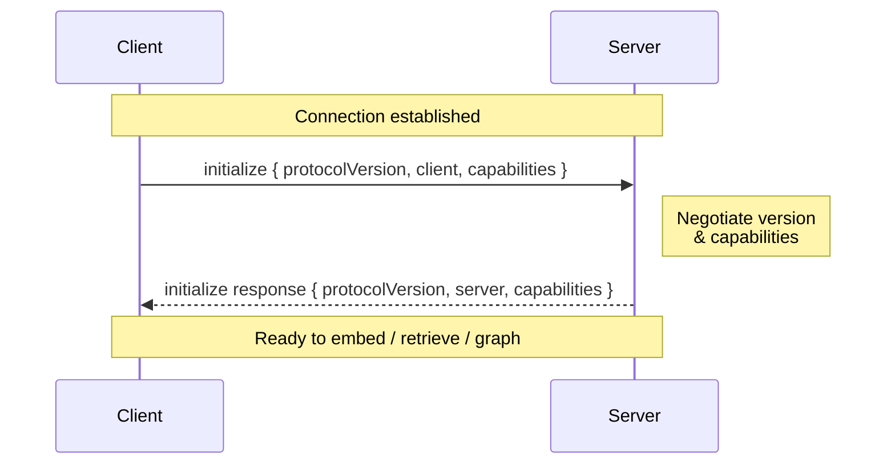

`initialize` is the **first** request on every connection. No other method except
`info` may precede it. It negotiates the protocol version and exchanges
capabilities.

<br />



<br />

## `initialize`

<CodeGroup>
```json Request
{
  "jsonrpc": "2.0",
  "id": 0,
  "method": "initialize",
  "params": {
    "protocolVersion": 1,
    "client": { "name": "my-client", "version": "1.0" },
    "capabilities": {}
  }
}
```

```json Response
{
  "jsonrpc": "2.0",
  "id": 0,
  "result": {
    "protocolVersion": 1,
    "server": { "name": "my-engine", "version": "2.3.1" },
    "capabilities": {
      "retrieve": { "maxK": 200, "modes": ["dense", "sparse", "hybrid"], "fusion": ["rrf"], "mmr": true },
      "rerank": { "methods": ["cross-encoder", "colbert"] },
      "embed": { "dimension": 384, "identity": "bge-small-en" }
    }
  }
}
```
</CodeGroup>

### Request params

<ParamField path="protocolVersion" type="integer" required>
  The **highest** protocol version the client supports. Each peer supports the
  contiguous range `[1 .. protocolVersion]`.
</ParamField>
<ParamField path="client" type="object">
  `{ name, version }` — the client's identity, for logs and diagnostics.
</ParamField>
<ParamField path="capabilities" type="object">
  What the *client* can consume (same presence ⇒ supported shape). RCP/1 requires
  none — a client **MAY** advertise `streaming` (ready to receive progress) or
  `log`. Servers treat these as hints and **MUST NOT** require any.
</ParamField>

### Response result

<ResponseField name="protocolVersion" type="integer">
  The **negotiated** version, `min(client, server)`, governing the connection for
  its lifetime.
</ResponseField>
<ResponseField name="server" type="object">
  `{ name, version }` — the server's identity.
</ResponseField>
<ResponseField name="capabilities" type="object">
  Exactly what the server offers. See [Capabilities](/concepts/capabilities).
</ResponseField>

## Version negotiation

The `protocolVersion` on the wire is the **highest** each peer supports. The
negotiated version is `min(client.protocolVersion, server.protocolVersion)` and
is what the server returns.

<Steps>
  <Step title="Server floor">
    Because RCP/1 is the floor, the negotiated result is always `≥ 1` in
    practice. A server returns `-32002` (`VersionMismatch`) **only** if it cannot
    satisfy the floor.
  </Step>
  <Step title="Client floor">
    A client that receives a negotiated version **lower** than its own minimum
    **MUST** abort rather than speak a dialect it does not implement.
  </Step>
</Steps>

## `info`

`info` has the **same shape as `initialize.result`** but causes **no state
change** and is callable at any time — before `initialize`, or to re-read
identity and capabilities later.

<CodeGroup>
```json Request
{ "jsonrpc": "2.0", "id": 9, "method": "info", "params": {} }
```
</CodeGroup>

<Info>
`info`, `ping`, and `shutdown` are the only methods a server answers **before**
`initialize`. Every capability-gated method called pre-`initialize` returns
`-32001` (`NotInitialized`).
</Info>
